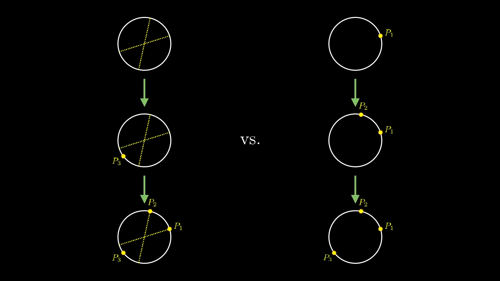

# The hardest problem on the hardest test

<iframe width="560" height="315" src="https://www.youtube.com/embed/OkmNXy7er84" frameborder="0" allow="accelerometer; autoplay; clipboard-write; encrypted-media; gyroscope; picture-in-picture" allowfullscreen></iframe>

Do you guys know about the Putnam?
It's a math competition for undergraduate students.
It's 6 hours long and consists of 12 questions, broken up into two different 3-hour sessions.
With each question being scored on a 1-10 scale, the highest possible score is 120.
And yet, despite the fact that the only students taking it each year are those who are clearly already pretty into math, given that they opt into such a test, the median score tends to be around 1 or 2.

It's a hard test.

And on each section of 6 questions, the problems tend to get harder as you go from 1 to 6, although of course difficulty is in the eye of the beholder.

 [Insert image labeling A1 through A6 and B1 through B6 as ranging from "pretty hard" to "can I go home"]

But the thing about the 5's and 6's is that even though they're positioned as the hardest problems on a famously hard test, quite often these are the ones with the most elegant solutions available, often involving some subtle shift in perspective that transforms it from challenging to simple.

Here I'll share with you one problem which came up as question A6 on the [1992 Putnam exam](https://kskedlaya.org/putnam-archive/1992.pdf).
Rather than just jumping straight to the solution, which in this case will be surprisingly short, let's take the time to walk through how you might stumble upon the solution yourself.
That is, this is a story about the problem-solving process, moreso than the particular problem used to exemplify it.

Here's the question:

 [Maybe instead of writing the question, take a screenshot of the exam itself linked above, or otherwise display it in such a way to emphasizes the context, and makes the reader feel like they're actually reading the test and not some watered down version.]

**If you choose 4 random points on a sphere, and consider the tetrahedron which has these points as its vertices, what's the probability that the center of the sphere is inside the tetrahedron?**

 [Instead of an animation, show 3 successive images.  One showing four random points on the sphere, one showing them connected to make a tetrahedron, and one contrasting whether that tetrahedron contains teh center or not.  That last one can have an animation option, and given that it might require some light image editing to show two cases side-by-side, we can leave a note to ourselves that it's a TBD for phase 2, and just have a short animation clip in it's place for now, some subset of res/problem.mp4]

Take a moment to kind of digest the question. You might start thinking about which of these tetrahedra contain the sphere's center, which ones don't, and how you might systematically distinguish the two.
How do you approach a problem like this, where do you even start?
Well, it's often a good idea to think about simpler cases, so let's bring things down into 2 dimensions.

Suppose you choose three random points on a circle.
It's always helpful to name things, so let's call these fellows P1, P2, and P3.

 [Image of three random points, labeled]

What's the probability that the triangle formed by these points contains the center of the circle?

 [Image of when these points contain the center]
 [Image of when these points don't contain the center]

It's certainly easier to visualize now, but it's still a hard question.

So again, you ask yourself if there's a way to simplify what's going on.
We still need a foothold, something to build up from.
Maybe you imagine fixing P1 and P2 in place, only letting P3 vary.

 [Animation, from section 2:27 to 2:32 (roughtly)]

In doing this, you might notice that there's special region, a certain arc, where when P3 is in that arc, the triangle contains the circle's center.

 [Animation, from section 2:34 to 2:43 (roughtly).  In phase 2, this should be a still image better labeling the arc, and showing multiple locations for P3]

Specifically, if you draw a lines from P1 and P2 through the center, these lines divide the circle into 4 different arcs.
If P3 happens to be in the arc opposite P1 and P2, the triangle will contain the center.
Otherwise, you're out of luck.

 [Image showing the four arcs, e.g. from 2:50.  Maybe insert four iamges, showing P3 in all four possible arcs.]

If We're assuming all points of the circle are equally likely, what's the probability that P3 lands in that arc?

It's the length of that arc divided by the full circumference of the circle; the proportion of the circle that this arc makes up.
What is that proportion? This depends on the first two points.
If they are 90 degrees apart from each other, for example, the relevant arc is 1/4 of the circle.

 [Insert image of 90-degree case]

But if those two points are farther apart, the proportion might be closer to 1/2.

 [Insert image]

If they are really close, that proportion might be closer to 0.

 [Insert image]

If P1 and P2 are chosen randomly, with every point on the circle being equally likely, what's the average size of the relevant arc?

Maybe you imagine fixing P1 in place, and considering all the places that P2 might be.

 [Insert brief animation, e.g. 3:50 - 3:57]

All of the possible angles between these two lines, every angle from 0 degrees up to 180 degrees is equally likely, so every proportion between 0 and 0.5 is equally likely, making the average proportion 0.25.
Since the average size of this arc is 1/4 this full circle, the average probability that the third point lands in it is 1/4, meaning the overall probability of our triangle containing the center is 1/4.

<video style="width:100%;" controls loop>
  <source src="res/2d_4.mp4" type="video/mp4">
Your browser does not support the video tag.
</video>

    

        
License

        
            This video was created by <a href="https://github.com/3b1b"> Grant Sanderson </a> and is licensed under the <a href="https://creativecommons.org/licenses/by-nc-sa/2.0/"> Creative Commons Attribution-NonCommercial-ShareAlike 2.0 Generic (CC BY-NC-SA 2.0) </a>.
        
    

Great! Can we extend this to the 3d case? If you imagine 3 of your 4 points fixed in place, which points of the sphere can that 4th point be on so that our tetrahedron contains the sphere's center?
As before, let's draw some lines from each of our first 3 points through the center of the sphere.

 [Insert image showing these three lines]

And it's also helpful if we draw the planes determined by any pair of these lines.

 [Insert image showing these three planes]

These planes divide the sphere into 8 different sections, each of which is a sort of spherical triangle.
Our tetrahedron will only contain the center of the sphere if the fourth point is in the section on the opposite side of our three points.

 [Insert images showing some examples of that fourth point location]

Unlike the 2d case, it's rather difficult to think about the average size of this section as we let our initial 3 points vary.
Those of you with some multivariable calculus under your belt might think to try a surface integral.
And by all means, pull out some paper and give it a try, but it's not easy.
And of course it should be difficult, this is the 6th problem on a Putnam!

But let's back up to the 2d case, and contemplate if there's a different way to think about it.
This answer we got, 1/4, is suspiciously clean and raises the question of what that 4 represents.
One of the main reasons I wanted to cover this topic is that what's about to happen carries a broader lesson for mathematical problem-solving.

The lines that we drew from P1 and P2 through the origin made the problem easier to think about.
In general, whenever you've added something to your problem setup which makes things conceptually easier, see if you can reframe the entire question in terms of the thing you just added.

 [Insert image showing the two lines as "helpful new objects", e.g. frame 6:12]

In this case, rather than thinking about choosing 3 points randomly, start by saying choose two random lines that pass through the circle's center.
For each line, there are two possible points they could correspond to, so flip a coin for each to choose which of those will be P1 and P2.

 [Insert image of frame 6:52 showing first two steps of random procedure]

Choosing a random line then flipping a coin like this is the same as choosing a random point on the circle, with all points being equally likely, and at first it might seem needlessly convoluted way to describe choosing two random points.
But by making those lines the starting point of our random process things actually become easier.

We'll still think about P3 as just being a random point on the circle, but imagine that it was chosen before you do the two coin flips.

 [Insert image of frame 7:01 showing first two steps of the random procedure]

Because you see, once the two lines and a random point have been chosen, there are four possibilities for where P1 and P2 end up, based on the coin flips, each one of which is equally likely.
But one and only one of those outcomes leaves P1 and P2 on the opposite side of the circle as P3, with the triangle they form containing the center.
So no matter what those two lines and P3 turned out to be, it's always a 1/4 chance that the coin flips will leave us with a triangle containing the center.

    

    

        
License

        
            This image was created by <a href="https://github.com/3b1b"> Grant Sanderson </a> and is licensed under the <a href="https://creativecommons.org/licenses/by-nc-sa/2.0/"> Creative Commons Attribution-NonCommercial-ShareAlike 2.0 Generic (CC BY-NC-SA 2.0) </a>.
        
    

 [Perfect image choice!]

That's very subtle. Just by reframing how we think of the random process for choosing these points, the answer 1/4 popped in a different way from before.
And importantly, this style of argument generalizes seamlessly to 3 dimensions.

Again, instead of starting off by picking 4 random points, imagine choosing 3 random lines through the center, and then a random point for P4.

 [Image of three random lines and a single random point, e.g. frame 8:01]

That first line passes through the sphere at 2 points, so flip a coin to decide which of those two points is P1.
Likewise, for each of the other lines flip a coin to decide where P2 and P3 end up.

 [Insert animation from 8:34 to 8:40]

There are 8 equally likely outcomes of these coin flips, but one and only one of these outcomes will place P1, P2, and P3 on the opposite side of the center from P4.
So only one of these 8 equally likely outcomes gives a tetrahedron containing the center.
Isn't that elegant?

This is a valid solution, but admittedly the way I've stated it so far rests on some visual intuition.
Here is a [more formal write-up](https://lsusmath.rickmabry.org/psisson/putnam/putnam-web.htm){{ "LA_putnam" | cite }} of this same solution in the language of linear algebra by Ralph Howard and Paul Sisson, if you're curious.
This is common in math, where having the key insight and understanding is one thing, but having the relevant background to articulate this understanding more formally is almost a separate muscle entirely, one which undergraduate math students spend much of their time building up.

The main takeaway here is not the solution itself, after all who cares about random tetrahedra in a sphere?  Instead take not of the two key problem-solving tactics that led us to the solution, which most certainly carry over to many problems that do matter.

* Keep asking simpler versions of the question until you can get some foothold
* If some added construct proves to be useful, see if you can reframe the whole question around that new construct.

### Bibliography

 
