Notes: 
1.  Some of the images definitely need (a), (b), (c) labels. I was trying to get something that looked mostly right before finishing them up 
2.  The video hops back and forth between sound examples. I think it's a good idea to have the examples, but I am not sure if it's best to hop back and forth.
3.  I will embed the video, but I wasn't sure if we should put it at the top or the bottom.
4.  Still need to finishing licensing section at the bottom.

# A Visual Interpretation of Fourier Transforms

In this post, we will introduce a visual interpretation to Fourier transforms, which are super important in mathematics and most science and engineering fields.
To begin, we will start with the classic example of decomposing frequencies in sound waves.

## Fourier transform of sound waves

Imagine you are listening to a pure A tone, which has the frequency of 440 beats per second.
This means that if you were to measure the air pressure next to your ear over time, it would oscillate 440 times every second, as shown in the following image:

    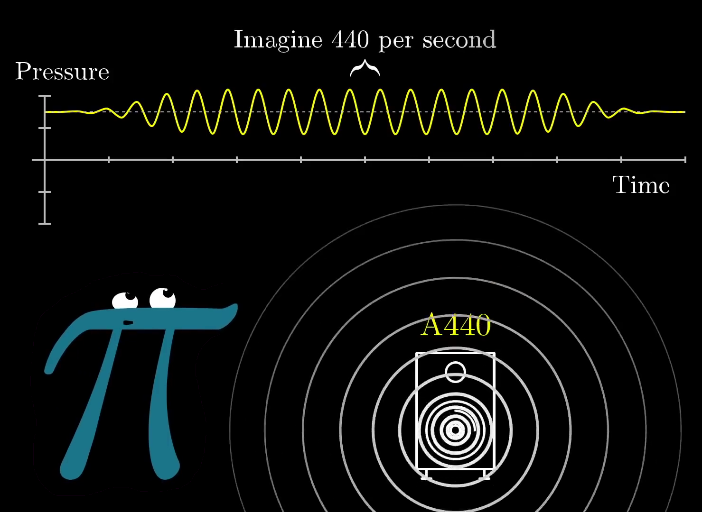

In this image, you are the pi creature on the left, and the speaker is emmitting the sound.

If you were to take a lower tone, like a D, it might oscillate slower at (for example) 294 beats per second. 
If you were to play both sounds at the same time without any external stimuli, the resulting pressure vs time graph would be a sum of the two of them put together, like so:

    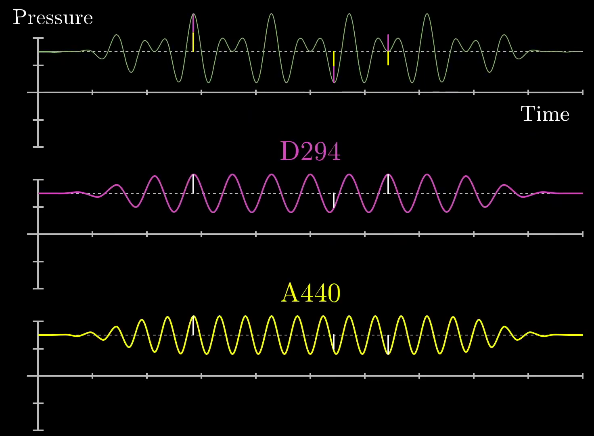

Here, we have drawn small white lines on the notes for A (bottom, yellow) and D (middle, pink) and shown that they create the final pressure vs time graph (top, green) when added together.
When the two waves are increasing at the same time, the resulting waveform is high.
Similarly, when the two waveforms are decreasing at the same time, we see that the resulting waveform is low.
Still at other points, the two waves cancel each other out.
All-in-all, the resulting waveform is not a pure sine wave, but instead something more complicated.
If more notes are added, the waveform becomes even more complicated:

    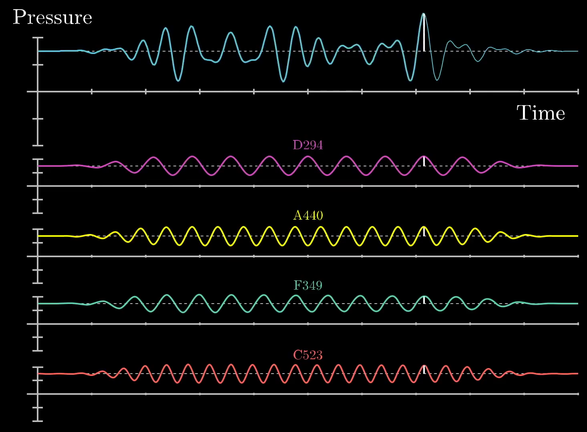

Similar to the previous image, we have drawn a wite line at a particular point in time to show that the final pressure vs time graph (top, blue) is a sum of 4 different frequencies: D (pink), A (yellow), F (teal), and C (red).
If you were to record yourself with a microphone, you might find waveform that is similar to this final pressure vs time graph which could similarly be composed of a set of different frequencies.

So now we are left with a somewhat more difficult question: how do we decompose a given signal into its constituent waveforms?
This is akin to unmixing multiple paint colors that have already been blended to form another color altogether.
To do this, we need to create some mathematical machinery that will allow us to treat signals with a particular frequency differently than other signals, essentially allowing us to identify how much of our final signal has come from a given frequency.
This machinery will have the same effect as the Fourier transform.

## Decomposing arbitrary signals 

To start, let's draw a sine wave at 3 beats per second from 0 to 4.5 seconds:

    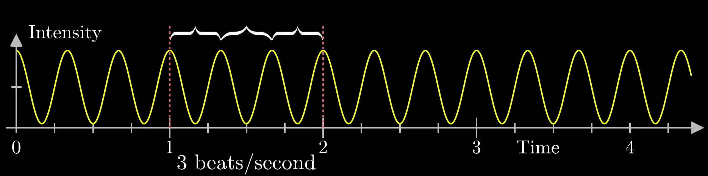

This is similar to the A or D frequencies mentioned in the previous section.
For this example, we are trying to uniquely identify that this wave is, in fact, oscillating at 3 beats per second.

To do this, we will start by "wrapping it up" around a circle.
This is not particularly clear, so imagine a little vector moving across the wave and also carving out the pattern along the circle such that low points in the wave are closer to the origin and high points are further away.
This might look something like this:

    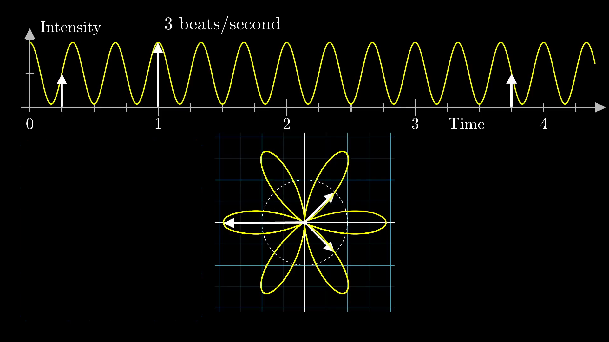

Here, we have drawn the arrow at 3 chosen timestamps: 0.25, 1, and 3.75 seconds.
Note that this graph is set such that 2 seconds along the sine wave correspond to a full rotation around the circle.
Another way of saying this is that the graph is being drawn at 0.5 cycles per second.
This means there are 2 different frequencies at play here:

1. The frequency of the sine wave at 3 beats per second
2. The frequency that we are wrapping the sine wave along the circle at 0.5 cycles per second

The second frequency could be changed to be whatever we want, and this choice of winding frequency will determine what the wound up graph looks like, as shown in the following plot:

    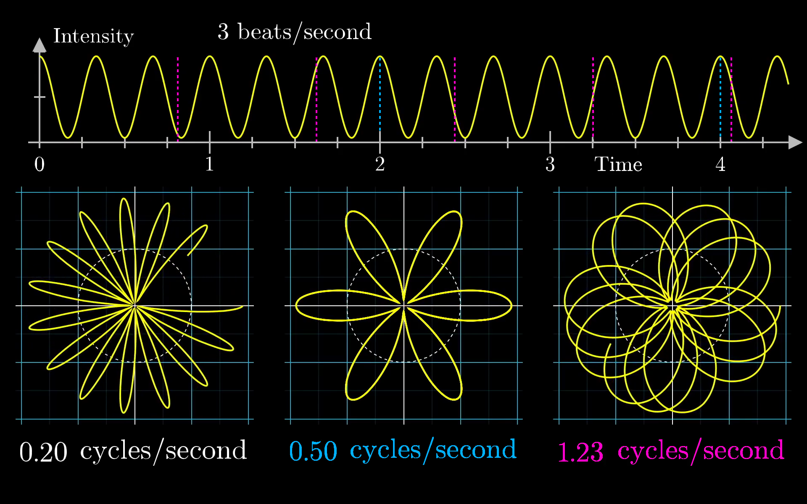

Here, the blue and pink dotted lines correspond to the distance along the original graph that corresponds to a full rotation along the circle for the 0.5 (blue) and 1.23 (pink) cycles per second winding frequencies.
Note that the 0.2 cycles per second winding frequency would have a dotted line at 5 seconds, which is slightly off the sine wave depicted in this figure.

No matter the case, the key intuition here is that we are wrapping the signal around a circle, and depending on how tightly we wind the sine wave, we can find different patterns.
So what happens when all of those lines line up to the peaks in the sine wave such that 3 cycles happen per second?
Well, we get the following plot:

    

Note that in this case, the waveform seems to be slightly shifted to the right.
Would we be able to use this information for our frequency unwinding machine?

Well, we actually can!
First, let's imagine that the pattern was made of something with some weight, like a metal wire.
In that case, we can put a dot at the center of mass location, and as we change the winding frequency, the center of mass will kind of wobble about.
In most cases, the center of mass stays relatively close to the origin, but when the winding frequency is the same as the frequency for our signal, the center of mass is unusually far to the right.

To keep track of this effect, let's draw the x-coordinate for the center of mass as the winding frequency changes.

    

Here, we have taken 5 separate snapshots of the sine wave wound around the circle for winding frequencies of 0.2, 1.5, 3, 4, and 5 cycles per second.
In each figure, we have plotted the center of mass as a red dot, and it is clear that the dot is furthest from the center of the plot with a winding frequency of 3 cycles per second.
Away from that winding frequency, the center of mass location seems to wobble around the center of the plot.

There is one small caveat: the center of mass seems to be a maximum distance from the center of the plot at a winding frequency of 0 cycles per second.
What gives?
Well, this is because we have started with a sine wave that ranges from 0 to 2, and when the winding frequency is 0, the wire is just a straight line pointing to the right, meaning that the center of mass is halfway between 0 and 2, or 1.
As a note, the spike at the start could be fixed by centering the initial sine wave around 0 and dipping into negative values, like so:

    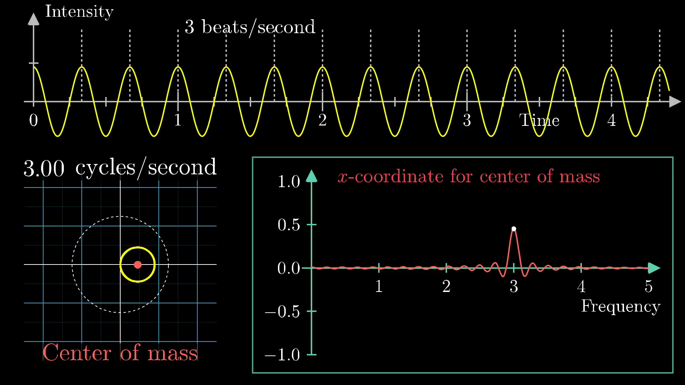

We opted to use a purely positive sine wave for this post because it makes the winding frequency patterns more prominent.

At this stage, we can call this winding machine as the "Almost Fourier Transform" of the original signal as it allows for us to pick out the frequency of the signal.
If we were to take a different signal, like one with a lower frequency of 2 beats per second, we could do the same thing and find a peak at 2 cycles per second, as shown here:

    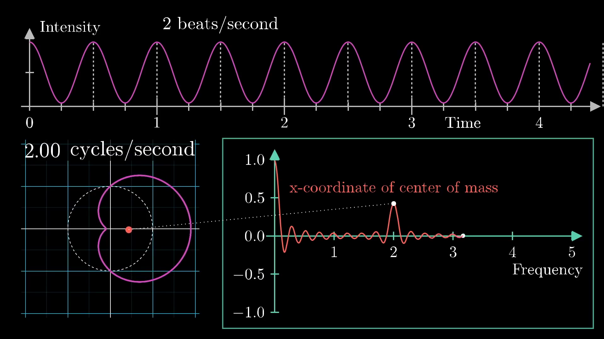

The most interesting aspect of this machine is that it will allow us to decompose any arbitrary signals into it's constituent waveforms.
To show this, let's combine the 2 and 3 frequency waves and do the same operation: tracking the center of mass coordinate and look for peaks in the winding frequency plot.
This is shown below:

    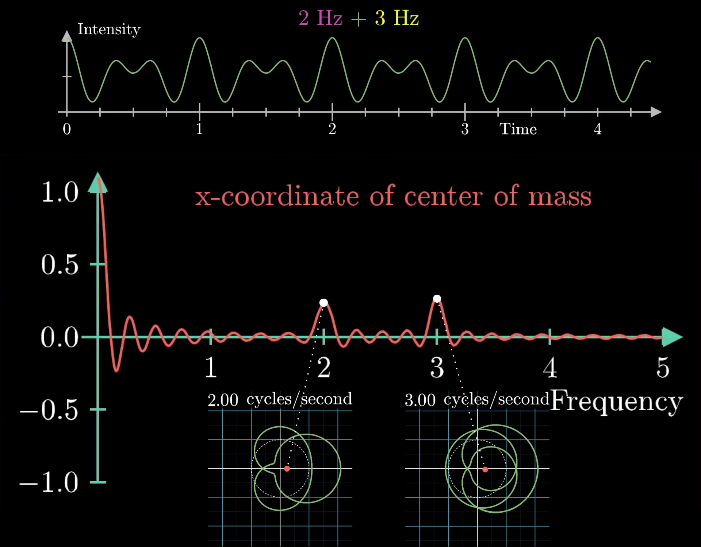

Here, we see 2 different frequencies at both 2 and 3 beats per second, which is exactly the same as the two "Almost Fourier Transformed" plots put together.
Simply put, the sum of the two "Almost Fourier Transformed" signals is the same as the "Almost Fourier Transform" of the two summed together, as shown here:

    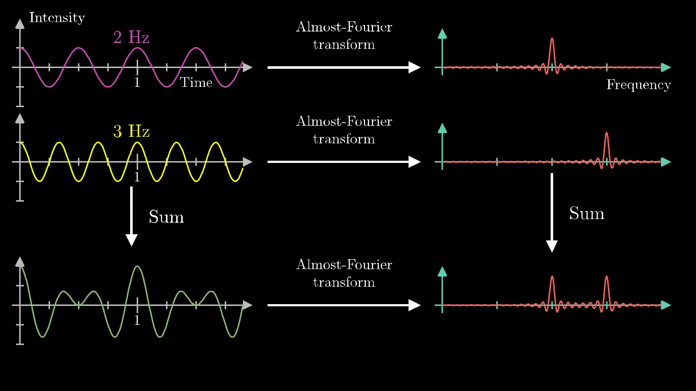

So this little mathematical machine does exactly what we wanted: it pulls out the constituent frequencies from a provided waveform, essentially unmixing a mixed bucket of paint.
Before moving on to the mathematical formalism here, it is a good idea to discuss key application of this machine in sound editing, which is similar to the application we showed above with the Fourier transform of sound waves.

## An example in sound editing

Let's imagine that you have a voice recording, but there is an annoying ringing sound in it that you want to get rid of.
Remember that this signal will be received as a plot of intensity over time.
Ideally, we would like to think of this signal in terms of frequencies, so we need to take the Fourier Transform of the signal to find the most prominent frequencies.
From there, we will the annoying high-pitched ringing sound as a spike on the far right of the plot, as shown below:

    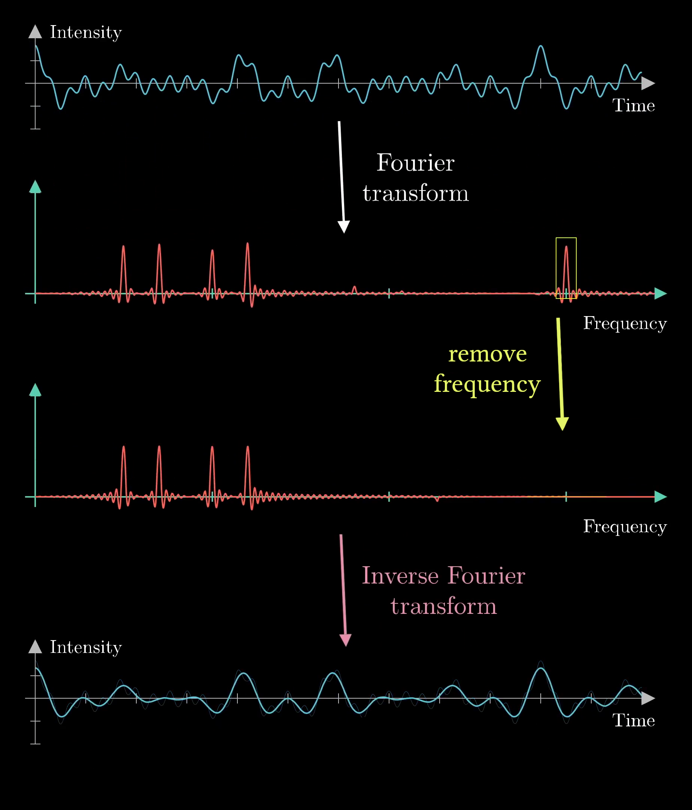

If we remove the spike by smooshing it out on the frequency plot, we will have a sound that is almost identical to the recording, but without the ringing.
To go back to the original signal, we need to use another concept known as the inverse Fourier transform, and after applying this operation, we have effectively removed the high-pitched ringing noise from the signal.

Note: this image needs a rework. I like that everything is on the same plot because it shows the concept for the full section in a single image, but maybe it's best to split it into two separate images and have the original signals faded behind the new ones?

So at this stage, we should get back to the heart of this post: what exactly is the mathematical formalism for a Fourier Transform?

## Mathematical formalism of Fourier transform

Going back to the previous example of the "Almost Fourier Transform," the first thing one might criticize is the fact that the movement of the center of mass for our winding wire has both an $$x$$ and a $$y$$ component, but we are only plotting the $$x$$-component!
Let's attack that issue first.

When dealing with 2-dimensional topics in math, it's often elegant to think of the second dimension as the complex plane.
For this example, the center of mass would become complex number with both a real and imaginary part.
One key advantage to this is that complex numbers lend themselves to descriptions of topics dealing with winding and rotation.

For example, Euler's formula famously tells us that if we were to take $$e^{i n}$$, where $$n$$ is some arbitrary number (like 2.0), and $$i$$ is the typical complex variable of $$\sqrt{-1}$$, we will find ourselves on the point we would get by walking counter-clockwise $$n$$ units along a circle of radius 1 in the complex plane, as shown below:

    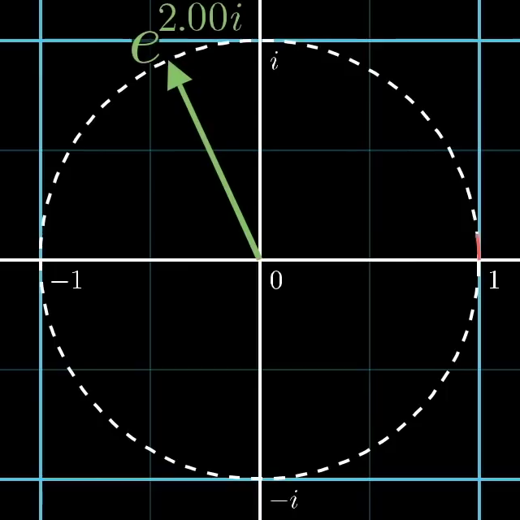

If you are curious, there is a full video [here](LINK) for why this is the case.

So how might we describe rotating at a rate of $$f$$ cycles per second?
Well, it would simply be:

$$
e^{2\pi i f t}
$$

Where $$2\pi$$ is the full length of the circumference of the circle, $$f$$ is the desired frequency, and $$t$$ is a variable for time.
This means that at any given time $$t$$, we have progressed some amount along the circle.
Ultimately, this gives us nice notation for describing how we might wind ourselves around a circle, but the notation for Fourier transforms is that we move in the clockwise (not counter-clockwise) direction, so it is more accurate to use $$e^{-2\pi i f t}$$ with a negative sign.

If we were to take any signal and describe it as a function, like $$g(t)$$, then

$$
g(t)e^{-2\pi i f t}
$$

will provide the function of $$g$$ at time $$t$$ and also the point along the circle $$e^{-2\pi i f t}$$.
This is almost precisely the same as the winding machine we created before!
Now we just need some sort of formula to capture the motion of the center of mass.

To approximate this, one might sample a large set of different times along the provided waveform, see where they end up on the wound-up graph, and take an average:

$$
\frac{1}{N}\sum_{k=1}^N g(t_k)e^{-2\pi i f t}.
$$

Pictorially, it would look like this:

    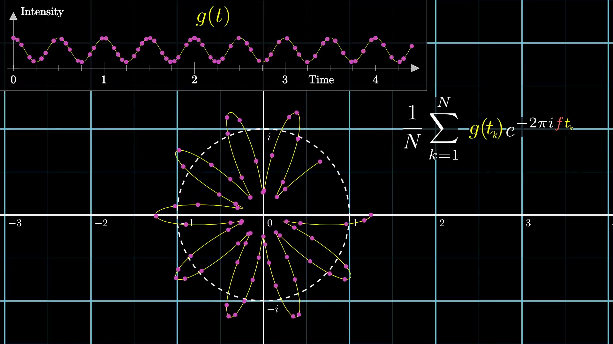

As we add more points, it becomes more accurate, and in the continuous limit, the sum becomes an integral:

$$
\frac{1}{t_2-t_1}\int_{t_1}^{t_2} g(t_k)e^{-2 \pi i f t}.
$$

Here, we still need to divide the equation based on the size of the time interval $$(t_2-t_1)$$.
Though this might seem intimidating, the whole expression is really just finding the center of mass of the wound-up graph.
There is now just one small distinction between the mathematical description provided here and the full Fourier transform.
Namely, the full Fourier transform does not require a time interval and instead works from $$-\infty$$ to $$+\infty$$:

$$
\int_{-\infty}^{\infty} g(t_k)e^{-2\pi if t}.
$$

This might seem a bit arbitrary, but it is worth thinking about for a bit.
 without the $$1/{t_2-t_1}$$ term, this equation will no longer be bounded within a time domain.
This is actually fine in principle because many signals are of finite time, and even if the signal is an infinite wave, this only serves to make the peaks more distinguished.

## Summary

So that's the end of this post.
The hope was that we could provide a more intuitive description for what a Fourier transform actually is and build the mathematics from a more visual perspective.

Simply put, the Fourier transform is an operation that will take any signal, $$g(t)$$ in the time domain and transform it into the frequency domain where instead of having time on the $$x$$ axis, it has frequency, which we have been calling the winding frequency.
This output function will be called $$\hat g(f)$$, and note that the hat is common notation for the output of the Fourier transform.
Remember that $$\hat g(f)$$ will be a complex number that corresponds to the strength of the given frequency in the original signal.

As a final note, the winding graphs we have been showing are simply the real component of that output, but it is possible to also plot the imaginary part, and that would look like this:

    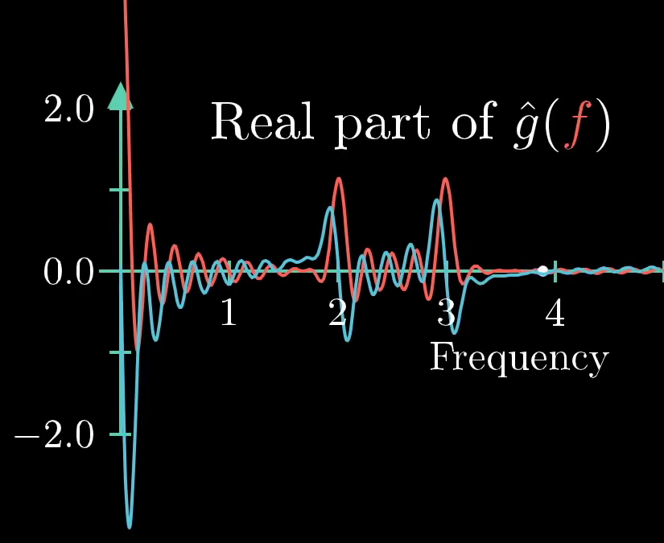

Note that all of this comes from the formula we built up:

$$
\hat g(f) = \int_{-\infty}^{\infty} g(t_k)e^{-2 \pi i f t}.
$$

Again, it is certainly a daunting formula; however, it is built up of a bunch of smaller parts:

1. exponentials can be seen as rotation
2. multiplying that rotation by $$g(t)$$ corresponds to walking a certain amount around the complex circle
3. The integral can be interpreted in terms of the center of mass of the wound-up graph

There is a lot more to say about this, but this will wrap up the discussion for now.
Please let us know if there's anything else you would like to discuss!

## License

##### Text

The text of this chapter was written by [Grant Sanderson](https://github.com/3b1b) and [James Schloss](https://github.com/leios) and is licensed under the [Creative Commons Attribution-ShareAlike 4.0 International License](https://creativecommons.org/licenses/by-sa/4.0/legalcode).

##### Images/Graphics
- The image "[A 440](res/a440.png)" was created by [Grant Sanderson](https://github.com/3b1b) and [James Schloss](https://github.com/leios) and is licensed under the [Creative Commons Attribution-ShareAlike 4.0 International License](https://creativecommons.org/licenses/by-sa/4.0/legalcode).

[

](https://creativecommons.org/licenses/by-sa/4.0/)
